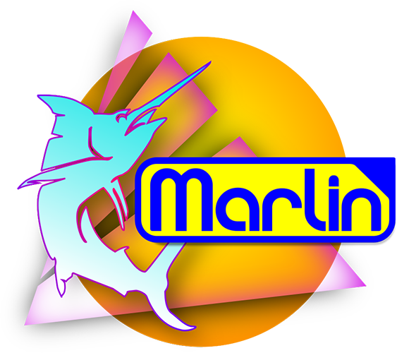

  
  

<h1 align="center">Marlin 3D Printer Firmware</h1>

# Tevo Tarantula RS / Homers Odysseus RS — Configuration

Configuration for the Tevo Tarantula RS / Homers Odysseus RS with the following specifics:

- Board: **MKS SGEN L v1.0**
- Temperature sensor: **PT1000**
- Stepper drivers: **TMC2209 in UART mode**
- Bed probe: **BLTouch (3DTouch from TriangleLabs)**
- **Modified hotend**
